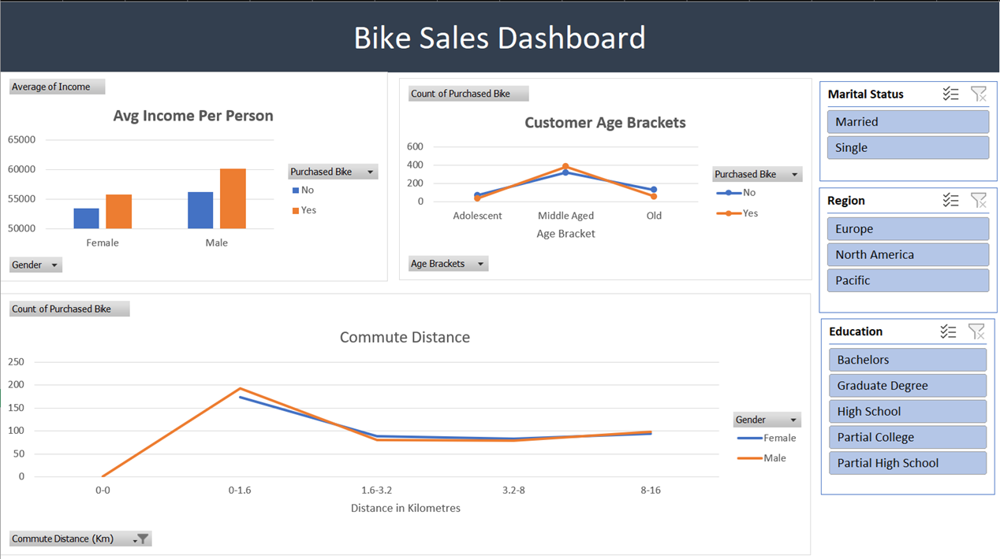

# Bike Sales Dataset
This was a fun project to work on, even though the data set was relativley small, I was able to apply various skills to achieve the results I wanted. 

Once the Excel file has been opened, you will notice multiple sheets, These contain the raw dataste, worksheet, pivot tables and the final dashboard.

## Identifying useful data
The first thing I did when looking at the dataset was identify useful information such as Age, Gender, Region, Income, Gender, Marital Status. All of this information could be used to generate interesting metrics to identify data trends. 

## Data Formatting & Cleaning
Data cleaning is essential for generating accurate statistics and to prevent defects so my focus was on using formulas to.

-  Removing duplicate values
-  Standardising dates
-  Removing white spaces
-  Formatting numbers to the correct data types, removing unnecessary decimals and removing null values, for example on the income column.
-  Applying filters to ensure data was consistant across all columns

## Data Transformation
No what my data is clean, I was able to extrapolate useful information and create additional columns in my worksheet.

-  Age Brackets
I knew that I wanted to visualise a chart on my dashboard which depicted how many purchases were bade between male and females in different age brackets.

Seeming as I had a huge variety of ages, adding this to a chart would make things very messy with a lot of recurring values, therefore I used nested IF statements in a formula to create 'Adolescent', 'Middle Ages' and 'Old' brackets which showed some interesting trends. 

-  Miles to Kilometres
Working with miles was fine, but I also wanted to convert this value to kilometres, however the values were not numeric and also contained varying rich text.

To clean this, I substituted unnecessary text, and seperated out the before and after values which were separated originally by a hyphen, I performed a basic math conversion and then concatonated this data.

## Setting up Pivot Tables and Charts
Now that my data was complete, I was able to generate useful pivot tables, to help me visualise this information in the form of charts. The tables I focussed on for this project were:-

-  Average income per person
-  Customer commute distance (Miles)
-  Customer commute distance (Kilometres)
-  Customer age brackets

## Dashboard
Once I was happy with the above, I created a very simple dashboard, where I connected slicers so that insights could be identified based on various filters.

## Discovering Trends
Once my dashboard was completed I was able to identif the following useful trends.

-  Overall Males specifically Middle Aged, purchased over 60000 bikes in total, whilst women purchased 52000 (unfortunately this dataset didn't contain dates)
-  Barely any sales were made by Adolescent or Older customers.
-  BIkes prchases were at their peak between the 0 - 1.6 Kilometre commuting distance, purchases had a steep drop off rate for commuting distances above this metric.

